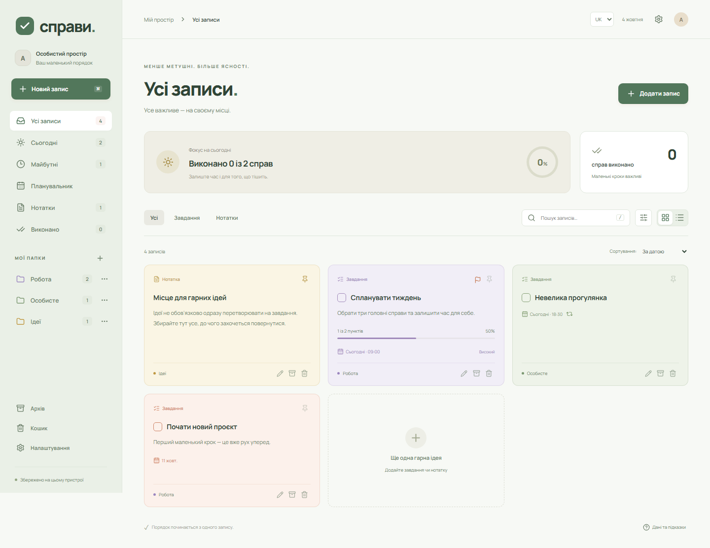
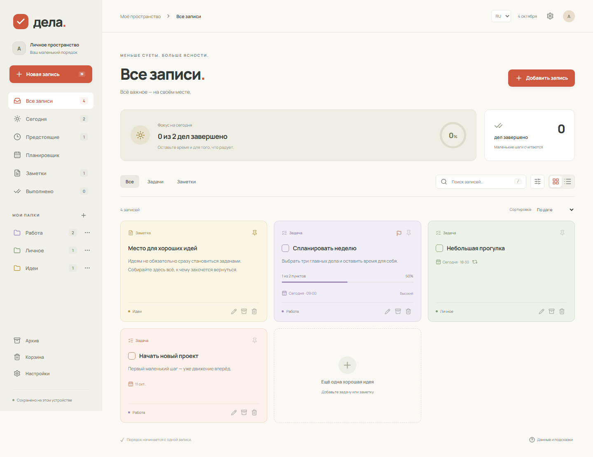
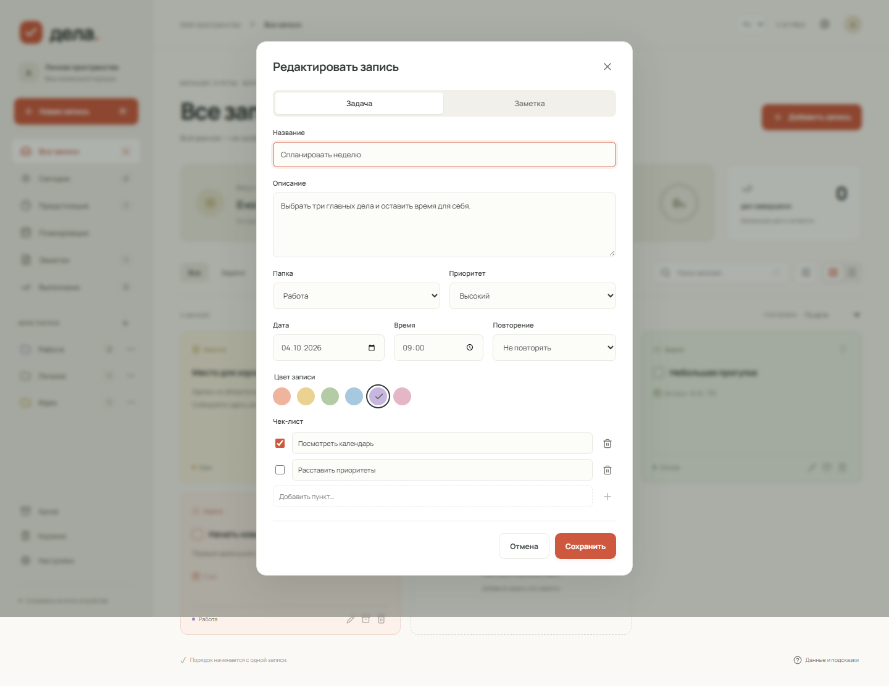
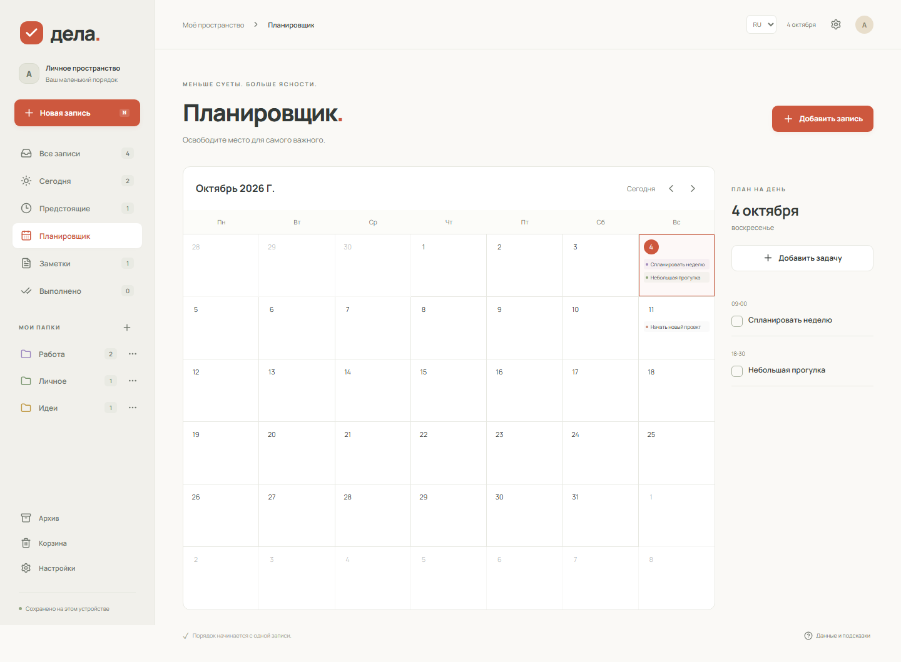
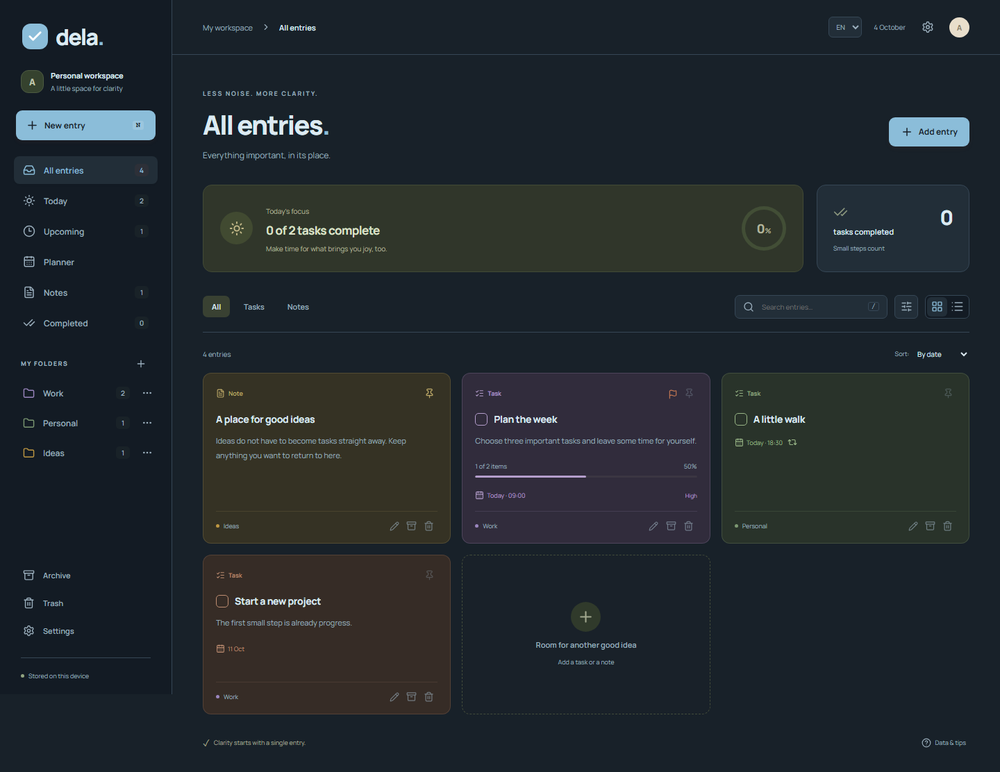
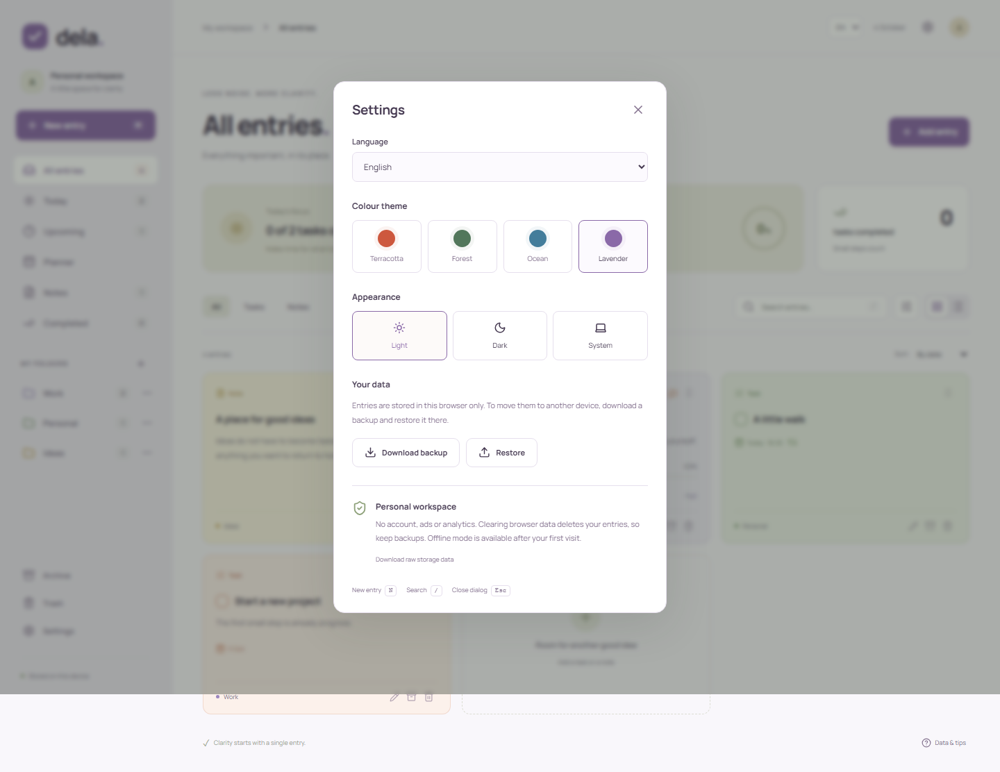
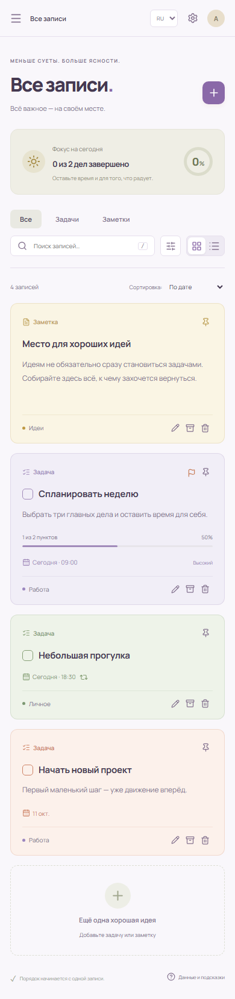

# Справи · Dela

Особистий записник для завдань, нотаток і планів. Спокійний інтерфейс, кольорові папки та календар — без реєстрації, реклами чи аналітики.

[Відкрити застосунок](https://alexmaster168.github.io/react-notes/) · [Перевірки та публікація](https://github.com/AlexMaster168/react-notes/actions)



## Можливості

- Завдання та текстові нотатки: створення, редагування, закріплення, архів і кошик із відновленням.
- Папки з власними назвами та кольорами. Видалення папки зберігає її записи.
- Шість кольорів записів, три пріоритети та чек-листи з прогресом.
- Календар місяця, план обраного дня, дата й час завдання, розділи «Сьогодні», «Майбутні» та «Виконано».
- Повторення щодня, щотижня чи щомісяця. Виконання створює наступне завдання; для коротких місяців обирається останній доступний день.
- Пошук у назвах, тексті й пунктах списків, фільтри за кольором і пріоритетом, сортування та вигляд картками або списком.
- Українська **за замовчуванням**, російська й англійська. Вибір мови зберігається; дати й календар локалізовані. Власний текст записів не перекладається.
- Чотири теми: **Теракота, Ліс, Океан, Лаванда**. Кожна працює у світлому, темному або системному режимі.
- Локальне збереження, оновлення між вкладками, скасування останніх дій, експорт і перевірений імпорт JSON.
- Адаптивний інтерфейс, клавіатурна навігація та офлайн-режим після першого завантаження.

## Скриншоти

Знімки зроблено з робочої виробничої збірки з демонстраційними записами. Вони не містять особистих даних.

### Записи та папки



### Редагування й повторення



### Планувальник



### English · Dark Ocean



### Мови, теми й резервні копії



### На телефоні



## Запуск

Потрібні Node.js **22.12+** та pnpm **12.9.1**. У CI використовується Node.js 24. Версію менеджера пакетів зафіксовано в `packageManager`, залежності — у `pnpm-lock.yaml`.

```sh
corepack enable
pnpm install --frozen-lockfile
pnpm dev
```

Локальна адреса: `http://127.0.0.1:5173`.

```sh
pnpm check        # ESLint, модульні тести, TypeScript і виробнича збірка
pnpm format:check # перевірка форматування
pnpm exec playwright install chromium
pnpm test:e2e     # користувацькі сценарії у Chromium
pnpm build
pnpm preview --port 4174
```

У другому терміналі після запуску preview:

```sh
pnpm test:smoke   # перевірка офлайн-перезавантаження та збереження
pnpm screenshots # оновити скриншоти README й іконки застосунку
```

`SCREENSHOT_URL` та `SMOKE_URL` дозволяють змінити адресу для цих перевірок.

## Дані та офлайн-режим

Застосунок призначений для **особистого використання на одному пристрої**. Записи зберігаються у `localStorage` цього браузера за версіонованою схемою. Сервер, акаунти, автоматична хмарна синхронізація й фонові push-нагадування не налаштовані. Старі записи попередньої Firebase-версії автоматично не імпортуються.

У налаштуваннях можна завантажити JSON-копію та відновити її в іншому браузері. Відновлення потребує явного підтвердження й замінює поточні записи. Пошкоджений файл або недоступне сховище не призводять до прихованого перезапису даних. Для відновлення пошкодженого сховища доступне завантаження його вихідного вмісту.

Очищення даних браузера видаляє записи. Резервні копії слід зберігати окремо. Підтримуються до 10 000 записів, 200 папок і 100 пунктів у кожному чек-листі; фактичний обсяг залежить від квоти браузера. Імпорт обмежено 10 МБ.

Service worker кешує інтерфейс та локальні шрифти. Офлайн-перезавантаження працює після першого відвідування сайту через HTTPS або localhost. Після оновлення доступний запит на завантаження нової версії; відкрите редагування не переривається.

## Технології

React 19.3 · TypeScript 6.0 · Vite 8.3 · pnpm 12 · Lucide · Vitest · Testing Library · Playwright · ESLint · Prettier · Workbox.

TypeScript 6.0.3 — остання версія, сумісна з поточним `typescript-eslint`; TypeScript 7 потребує його майбутнього оновлення. Застарілі Create React App, `node-sass`, Bootstrap та непотрібні залежності видалені. Шрифти Manrope постачаються разом зі збіркою, без запитів до Google Fonts.

| Частина                                | Розташування                                             |
| -------------------------------------- | -------------------------------------------------------- |
| Інтерфейс, навігація та фільтри        | `src/App.tsx`                                            |
| Модель, повторення й перевірка імпорту | `src/model.ts`                                           |
| Збереження, скасування та вкладки      | `src/useWorkspace.ts`                                    |
| Переклади й локалізація дат            | `src/i18n.ts`                                            |
| Редактор, календар і налаштування      | `src/Editor.tsx`, `src/Calendar.tsx`, `src/Settings.tsx` |
| Стилі та кольорові теми                | `src/styles.css`, `src/palettes.css`                     |
| Модульні й браузерні перевірки         | `src/*.test.ts`, `tests/planner.spec.ts`                 |
| Автоматична перевірка й публікація     | `.github/workflows/ci.yml`                               |

## Публікація

Push до `master` запускає форматування, ESLint, TypeScript, модульні й браузерні тести. Після успішної перевірки GitHub Actions збирає застосунок із базовим шляхом `/react-notes/` і публікує його в GitHub Pages. Pull request проходить перевірки без публікації.

Для іншого шляху задайте `DEPLOY_BASE` під час збірки. Для статичного хостингу в корені домену достатньо `pnpm build` та каталогу `dist`. `firebase.json` також налаштовано на `dist`; для Firebase потрібно обрати власний проєкт перед розгортанням.

## Клавіші

| Клавіша             | Дія                        |
| ------------------- | -------------------------- |
| `N`                 | Нова задача або нотатка    |
| `/`                 | Перейти до пошуку          |
| `Esc`               | Закрити діалог             |
| `Tab` / `Shift+Tab` | Переміщення між елементами |

MIT · AlexMaster168
